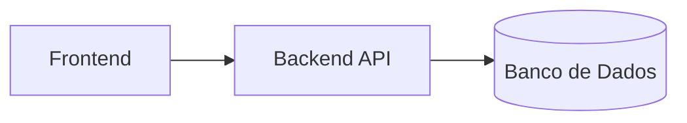
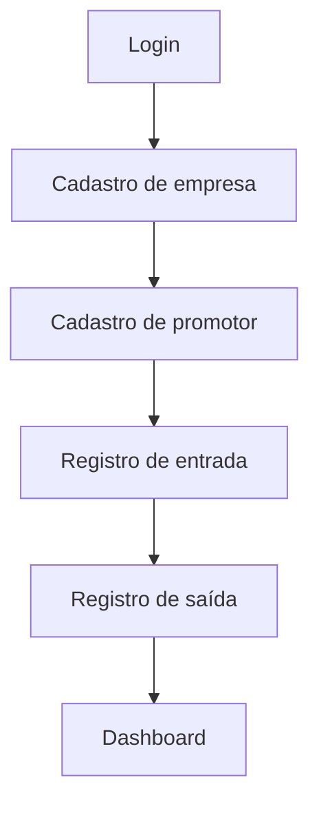

> 🇺🇸 [English Version](README_EN.md)

# Controle de Promotores

## Descrição

Sistema desenvolvido para controle de acesso de promotores em empresas, permitindo o registro de entrada e saída, cálculo do tempo de permanência e visualização de métricas operacionais por meio de dashboard e relatórios.

O projeto está sendo desenvolvido como parte de um Trabalho de Conclusão de Curso (TCC), com foco em organização, rastreabilidade e apoio à tomada de decisão.

---

## Objetivo

Centralizar o controle de presença de promotores, substituindo processos manuais por uma solução digital que permita:

* Registro estruturado de acessos
* Monitoramento em tempo real de promotores ativos
* Cálculo automático de permanência
* Geração de dados para análise gerencial

---

## Tecnologias Utilizadas

### Backend

* ASP.NET Core Web API
* Entity Framework Core
* Autenticação via JWT

### Banco de Dados

* MySQL (estrutura oficial do projeto)
* SQLite (utilizado para desenvolvimento local)

### Frontend

* HTML
* CSS
* JavaScript

---

## Arquitetura

O sistema está dividido em três camadas principais:

* **Backend:** responsável pelas regras de negócio, autenticação e exposição da API
* **Frontend:** responsável pela interface e consumo dos endpoints
* **Banco de Dados:** responsável pela persistência e estrutura dos dados



---

## Estrutura do Projeto

```text
ControlePromotores.Api/
│
├── Controllers/   # Endpoints da API
├── Services/      # Regras de negócio
├── Models/        # Entidades do sistema
├── DTOs/          # Contratos de entrada/saída
├── BD/            # DbContext
├── Data/          # Inicialização de dados
├── Program.cs     # Configuração da aplicação
```

---

## Funcionalidades

* Autenticação de usuários (JWT)
* Cadastro de empresas
* Cadastro de promotores
* Registro de entrada
* Registro de saída
* Cálculo automático de permanência
* Consulta de promotores ativos
* Dashboard com métricas operacionais
* Geração de relatórios

---

## Execução do Projeto

### Backend

```bash
dotnet restore
dotnet run
```

A API estará disponível em:

```text
http://localhost:5297
```

Documentação via Swagger:

```text
http://localhost:5297/swagger
```

---

## Comunicação com a API

### Base URL

```text
http://localhost:5297/api
```

### Autenticação

Endpoints protegidos requerem token JWT:

```http
Authorization: Bearer {token}
```

---

## Fluxo Básico



---

## Exemplos de Uso da API

Abaixo estão exemplos básicos de utilização dos principais endpoints do sistema.

---

### Autenticação

```http
POST /api/Auth/login
```

```json
{
  "login": "admin",
  "senha": "admin123"
}
```

Resposta:

```json
{
  "token": "JWT_TOKEN_AQUI"
}
```

---

### Registro de Entrada

```http
POST /api/RegistrosAcesso/entrada
```

```json
{
  "promotorId": 1,
  "empresaId": 1,
  "usuarioId": 1,
  "observacao": "entrada normal"
}
```

Resposta:

```json
{
  "id": 1,
  "tipo": "entrada",
  "dataHora": "2026-04-18T17:00:00",
  "promotorId": 1,
  "empresaId": 1
}
```

---

### Registro de Saída

```http
POST /api/RegistrosAcesso/saida
```

```json
{
  "promotorId": 1,
  "empresaId": 1,
  "usuarioId": 1
}
```

Resposta:

```json
{
  "tipo": "saida",
  "permanenciaMin": 120
}
```

---

### Dashboard (Resumo do Dia)

```http
GET /api/Dashboard/hoje
```

Resposta:

```json
{
  "totalPromotoresAtivos": 1,
  "totalVisitasHoje": 2,
  "mediaHorasPorPromotor": 2,
  "totalRegistrosUltimos30Dias": 10
}
```

---

## Regras de Alinhamento

* O banco de dados oficial deve ser considerado a fonte de verdade
* Alterações estruturais devem ser alinhadas entre os membros do grupo
* O backend deve refletir a estrutura do banco
* O frontend deve consumir os endpoints existentes

---

## Ambiente de Desenvolvimento

* SQLite utilizado para desenvolvimento local
* MySQL utilizado como base oficial do projeto

---

## Segurança

Este repositório não deve conter:

* Credenciais de banco de dados
* Tokens ou chaves reais
* Informações sensíveis em arquivos de configuração

Utilizar variáveis de ambiente ou arquivos locais não versionados quando necessário.

---

## Status do Projeto

* Backend implementado e funcional
* Autenticação JWT ativa
* Registro de acessos operacional
* Dashboard funcional

Integração com frontend em andamento.
git pull origin main --rebase
git push origin main
```

>>>>>>> origin/Mateus-branch
