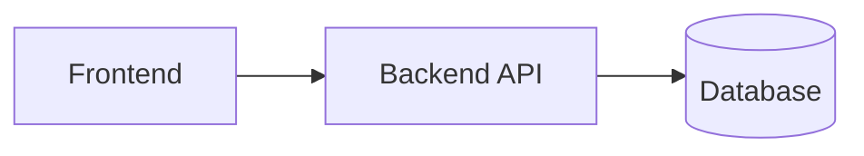
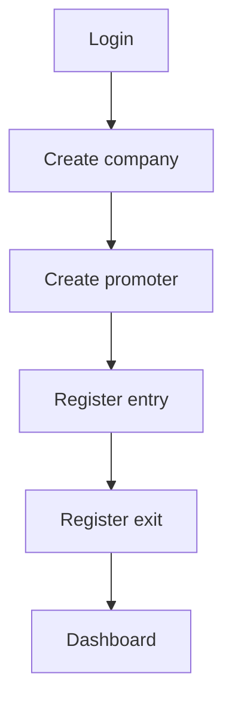

> 🇧🇷 [Versão em Português](README.md)

# Promoter Access Control

## Description

A system designed to manage promoter access to companies, enabling entry and exit tracking, automatic duration calculation, and visualization of operational metrics through dashboards and reports.

This project is being developed as part of a final course project (Capstone/TCC), focusing on organization, traceability, and decision-making support.

---

## Objective

The goal of this system is to centralize promoter attendance control, replacing manual processes with a digital solution that enables:

* Structured access records
* Real-time monitoring of active promoters
* Automatic duration calculation
* Data generation for managerial analysis

---

## Technologies Used

### Backend

* ASP.NET Core Web API
* Entity Framework Core
* JWT Authentication

### Database

* MySQL (official project structure)
* SQLite (used for local development)

### Frontend

* HTML
* CSS
* JavaScript

---

## Architecture

The system is divided into three main layers:

* **Backend:** responsible for business logic, authentication, and API endpoints
* **Frontend:** responsible for user interface and API consumption
* **Database:** responsible for data persistence and structure



---

## Project Structure

```text
ControlePromotores.Api/
│
├── Controllers/   # API endpoints
├── Services/      # Business logic
├── Models/        # System entities
├── DTOs/          # Data transfer objects
├── BD/            # DbContext
├── Data/          # Data initialization
├── Program.cs     # Application configuration
```

---

## Features

* User authentication (JWT)
* Company management
* Promoter management
* Entry registration
* Exit registration
* Automatic duration calculation
* Active promoters tracking
* Dashboard with operational metrics
* Report generation

---

## Running the Project

### Backend

```bash
dotnet restore
dotnet run
```

The API will be available at:

```text
http://localhost:5297
```

Swagger documentation:

```text
http://localhost:5297/swagger
```

---

## API Communication

### Base URL

```text
http://localhost:5297/api
```

### Authentication

Protected endpoints require a JWT token:

```http
Authorization: Bearer {token}
```

---

## Basic Flow



---

## Alignment Rules

* The official database schema must be treated as the source of truth
* Structural changes must be aligned with the team
* The backend must follow the database structure
* The frontend must consume the existing API endpoints

---

## Development Environment

* SQLite used for local development
* MySQL used as the official project database

---

## Security

This repository must not contain:

* Database credentials
* Real tokens or secret keys
* Sensitive configuration data

Use environment variables or local configuration files when necessary.

---

## Project Status

* Backend implemented and functional
* JWT authentication active
* Access control operational
* Dashboard functional

Frontend integration in progress.
